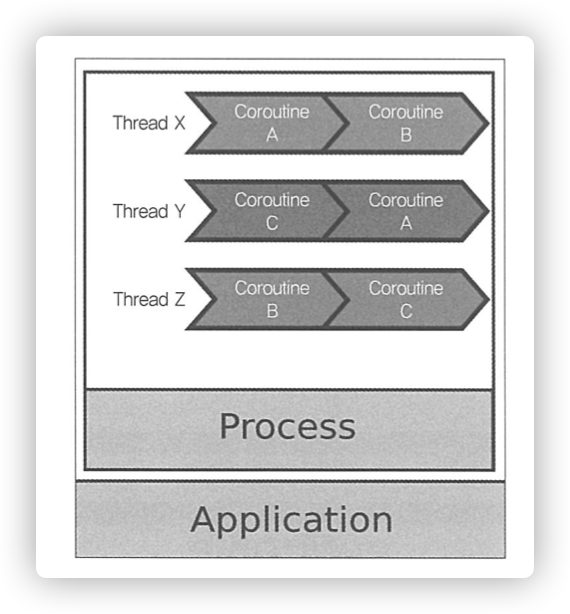

## 1. Concurrent World
- [코루틴이란?](#%EC%BD%94%EB%A3%A8%ED%8B%B4%EC%9D%B4%EB%9E%80)
- [가벼운 코루틴을 만들어보자](#%EA%B0%80%EB%B2%BC%EC%9A%B4-%EC%BD%94%EB%A3%A8%ED%8B%B4%EC%9D%84-%EB%A7%8C%EB%93%A4%EC%96%B4%EB%B3%B4%EC%9E%90)
- [동시성 vs 병렬성](#%EB%8F%99%EC%8B%9C%EC%84%B1-vs-%EB%B3%91%EB%A0%AC%EC%84%B1)
- [코루틴에서의 자원관리](#%EC%BD%94%EB%A3%A8%ED%8B%B4%EC%97%90%EC%84%9C%EC%9D%98-%EC%9E%90%EC%9B%90%EA%B4%80%EB%A6%AC)
- [코루틴 빌더](#%EC%BD%94%EB%A3%A8%ED%8B%B4-%EB%B9%8C%EB%8D%94)

### 코루틴이란?

같은 프로세스라도 쓰레드를 어떻게 운영하느냐에 따라서 처리량이 많이 달라질 수 있죠 🔄  

코틀린의 경우 `코루틴` 이라는 동시성이 가능하도록 하는 기능이 있습니다  
코루틴은 일반적으로 `경량 쓰레드` 라고 불리워지며 쓰레드당 하나의 명령만 실행됩니다  

즉, 쓰레드보다는 생성비용이 가볍고 빠르게 생성할 수 있다는 것에 장점이 있습니다 👍  

### 가벼운 코루틴을 만들어보자

```kotlin
suspend fun createCoroutines(amount: Int) {
    val jobs = arrayListOf<Job>()
    jobs += CoroutineScope(Dispatchers.Default).launch {
            println("Start $i in ${Thread.currentThread().name}")
            delay(1000)
            println("End $i in ${Thread.currentThread().name}")
        }
    jobs.forEach { it.join() }
}
```

위에 대한 코드는 1초의 blocking job 을 `amount` 의 개수만큼 생성하는 코드에요  
amount 를 `10_000` 개를 생성하면 1100ms 에 처리가 모두 끝나는 군요  

그렇다면 10배인 `100_000` 개를 생성하면 11000ms 가 걸릴까요? 🤔  

*하지만 아닙니다*  

신기하게도 `1600`ms 로 수행이 끝나게 됩니다  
왜 그럴까요? 결국 코루틴이라는 것은 하나의 쓰레드에서 수행을 시작하지만 수행 완료 시점에서는 다른 쓰레드에서 끝날 수 있기 때문입니다  



즉 `A라는 코루틴은 X 쓰레드에서 시작하여 Y 쓰레드에서 끝날 수 있습니다`  

참 신기하죠?  

우리는 그래서 `동시성` 과 `병렬성` 에 대한 차이를 이해해야 합니다 


### 동시성 vs 병렬성

바로 설명해볼게요  
|제목|설명|
|---|---|
|동시성|여러 작업이 동시에 실행되는 것 처럼 보이는 것|
|병렬성|실제로 여러 작업이 동시에 실행되는 것|

쉽게 말씀드리면 `동시성` 은 여러 개의 작업을 빠르게 번갈아가면서 수행하므로 사용자가 동시에 처리되는 것 처럼 보이는 현상을 의미하고  
`병렬성` 은 여러 개의 작업을 같은 시간안에 모두 처리하는 것을 의미합니다  

> 동시성은 그래서 문맥교환(Context switching) 비용이 들고, 문맥교환이 많아질 수록 성능이 많이 저하될 수 있습니다  
> 그래서 코루틴도 잘못설계한다면 오히려 더 성능이 저하될 수 있죠   
> 특히 `I/O` 가 발생하지 않는 로직에 코루틴을 적용한다면 오히려 더 성능저하가 일어날 수 있어요

그래서 `병렬성` 을 가진다는 것은 자동적으로 `동시성`을 만족하게 됩니다  
하지만 `동시성` 을 가진다고 꼭 병렬성이 되는 것은 아니에요  

> 아~~주 쉽게 설명하면 병렬성은 CPU 단위를 의미하고  
> 동시성은 쓰레드 단위를 의미한다고 이해하시면 되요 (아주 야매로 기억할꺼면)

조금은 이해가 되셨을란지요 ㅎㅎ 😄  

### 코루틴에서의 자원관리

결국 **코루틴에서의 핵심은 경량쓰레드를 어떻게 관리할 것인지** 입니다  

이를 담당하는 것이 바로 `Dispatcher` 가 담당하게 됩니다  

```kotlin
public abstract class CoroutineDispatcher : 
    AbstractCoroutineContextElement(ContinuationInterceptor), ContinuationInterceptor
```

추상클래스로 지원하고 있으며 `javaDoc` 을 보시면 아래와 같은 설명이 있어요  

* `Dispatchers.Default`: 기본적으로 제공하는 dispatcher 이며 CPU 코어수에 따라 worker 쓰레드 수를 결정하게 됩니다
* `Dispatchers.IO`: I/O Operation 에 해당하는 공통된 pool 을 사용합니다
* `Dispatchers.Unconfined`: 코루틴을 시작한 쓰레드에서 코루틴을 시작하지만, 중간 처리는 다른 쓰레드에서도 완성할 수 있다

어떻게 쓰레드를 운영하고 관리할 것인지는 `Dispathcer` 에 달려 있는 것이죠  

### 코루틴 빌더

코루틴을 만드는 인터페이스는 3가지가 있습니다  

```kotlin
public fun <T> CoroutineScope.async(
    context: CoroutineContext = EmptyCoroutineContext,
    start: CoroutineStart = CoroutineStart.DEFAULT,
    block: suspend CoroutineScope.() -> T
): Deferred<T> {
    val newContext = newCoroutineContext(context)
    val coroutine = if (start.isLazy)
        LazyDeferredCoroutine(newContext, block) else
        DeferredCoroutine<T>(newContext, active = true)
    coroutine.start(start, coroutine, block)
    return coroutine
}
```

`async()`의 경우 반환값이 존재하는 코루틴을 생성하게 됩니다. 단 코루틴 내에서 예외가 발생할 수 있기 때문에 `Deferred` 로 감싸져서 리턴되게 되네요  


```kotlin
public fun CoroutineScope.launch(
    context: CoroutineContext = EmptyCoroutineContext,
    start: CoroutineStart = CoroutineStart.DEFAULT,
    block: suspend CoroutineScope.() -> Unit
): Job {
    val newContext = newCoroutineContext(context)
    val coroutine = if (start.isLazy)
        LazyStandaloneCoroutine(newContext, block) else
        StandaloneCoroutine(newContext, active = true)
    coroutine.start(start, coroutine, block)
    return coroutine
}

```

`launch()` 의 경우 결과를 반환하지 않고 실행을 하거나 실행을 취소할 수 있는 객체인 `Job` 객체를 반환하게 됩니다  

Job 의 상태는 총 6가지로 정의됩니다  
New -> Active -> Completing -> Completed  
Canceling -> Cancelled  


```kotlin
public fun <T> runBlocking(context: CoroutineContext = EmptyCoroutineContext, block: suspend CoroutineScope.() -> T): T {
    // ...
    return coroutine.joinBlocking()
}

`runBlocking()` 의 경우 코루틴들이 다 실행이 끝날때까지 기다리기 위한 인터페이스입니다  
위에서 작성한 예시들도 그래서 main 쓰레드에서 코루틴을 기다리게 되는 것이죠 ㅎㅎ 

